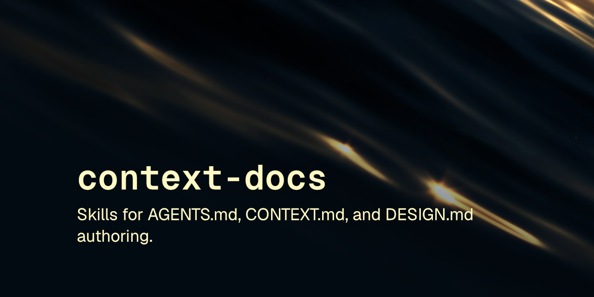

<p align="center"></p>

# scaffold

3 skills write AGENTS.md, CONTEXT.md, DESIGN.md. Docs agent actually needs.

[](LICENSE) [](https://skills.sh/robcsaszar/scaffold)

Skills for creating and reviewing the three standing context files an AI agent reads before touching a codebase: AGENTS.md, CONTEXT.md, and DESIGN.md.

These skills follow the [Agent Skills specification](https://agentskills.io/specification) so they can be used by any skills-compatible agent.

## Installation

### npx skills

```
npx skills add robcsaszar/scaffold
```

### Marketplace

```
/plugin marketplace add robcsaszar/scaffold
/plugin install robcsaszar-scaffold@scaffold
```

### Manually

Copy the `skills/` directory into your project's `.claude/skills/`.

## Installing a single skill

```
npx skills add robcsaszar/scaffold --skill ai-context-dot-md
```

Or manually, copy just that skill's directory:

```sh
cp -r skills/ai-context-dot-md /path/to/project/.claude/skills/
```

## Skills

| Skill | Description |
|-------|-------------|
| [ai-agents-dot-md](skills/ai-agents-dot-md) | Creates or reviews AGENTS.md files, the standing instructions a coding agent reads before acting on a repo |
| [ai-context-dot-md](skills/ai-context-dot-md) | Creates or reviews CONTEXT.md files: hierarchical, LLM-optimized documentation describing what a codebase is, its architecture, domain model, and conventions |
| [ai-design-dot-md](skills/ai-design-dot-md) | Creates or extracts DESIGN.md files: YAML design tokens plus ordered markdown sections capturing a design system for AI agents |

## License

[MIT](LICENSE) © Rob Csaszar
